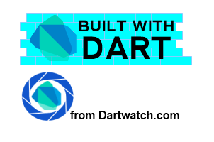

  

<h4>Newly Added </h4>
<ul>
  <li><a href="/projects/games/evillair/">Evil Lair</a></li>
	<li><a href="/projects/games/collision_clones/">Collision Clones</a></li>
	<li><a href="/projects/frameworks/bot/">Dart Bag of Tricks</a></li>
	<li><a href="/projects/frameworks/three/">Three.dart</a></li>
</ul>

# Welcome to BuiltWithDart

On this site you will find a showcase of some of the great applications that 
you can build with Google's [Dart](http://www.dartlang.org) language.  
Dart (aka dartlang) is a structured, class based, object orientated 
programming language for building web applications.  
While it runs on both the client and the server, this website is primarily 
concerned with browser based applications (although they may have 
a server component written in Dart).

### Demos

All the demos linked to on this site are written in Dart, which is then compiled 
to JavaScript.  While they _should_ work in all modern browsers, the Dart => JavaScript 
converter has been through some iterations since the early examples were built.  If you
 have problems running the examples, try using Chrome in the first instance.

### Developers
 

Most of the applications listed contain links to their source code - contact the developer for more information.  
In most instances, I've tried to credit the developer, and prvide a Google+ link.  If you find your work on this site
and you are not credited correctly, then [contact](/contact/) me!

### Tell us your story

 
If your app is Built With Dart, _tell us your story_.  We want to know about it.  Please use the [contact](/contact/) page
in and send some screenshots and text about the site.  Even better, write up a code walkthrough.

The [contact](/contact/) page has a contributors guide to help you get started.

