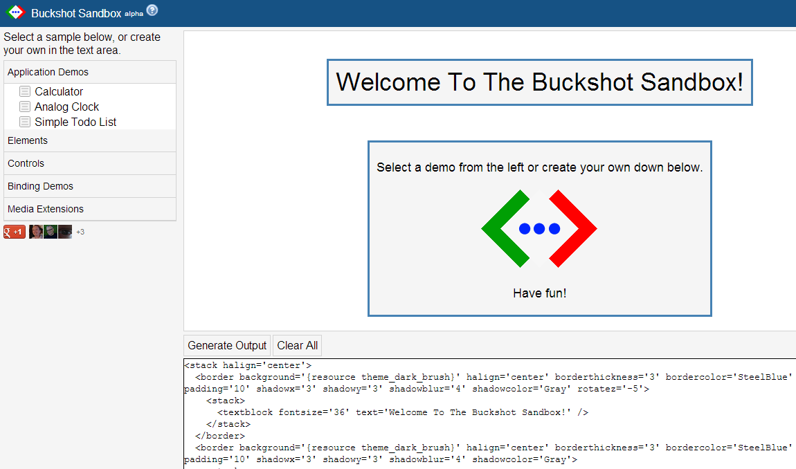
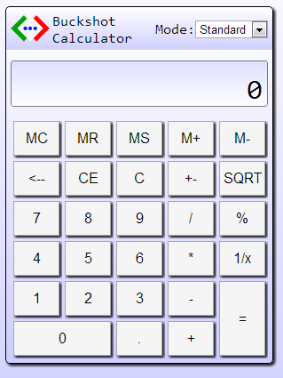

### Author's Notes

Buckshot is a multi-platform application framework. The library provides the foundations for other target platforms to build from. Some of the core features provided include a template parser, data-binding, events, actions, style templates, and more. Most developers will not import the core library directly, but will instead choose one of the platform extension libraries, such as HTML, SVG, and others. 

If you've worked with .net WPF or Silverlight then this framework will feel very familiar to you.

### Demos

[Launch Sandbox Demo](http://buckshotui.org/sandbox/)

[Launch Switchy Demo](http://www.buckshotui.org/switchy/)

