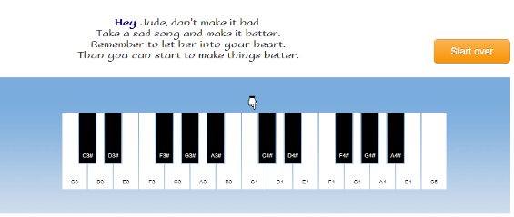
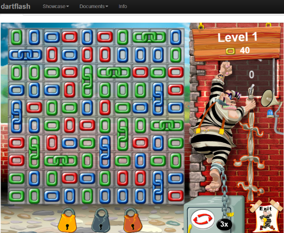

### Author's Notes

The dartflash library is intended for Flash developers who want to migrate their projects as well as their skills to HTML5. Therefore the library provides the familiar Flash API built on top of the Dart programming language. Dart is very similar to ActionScript 3 and avoids all the hassle of JavaScript.
This library provides the Flash API build on top of open web standards (HTML5). 

Developers who build applications with Flash may have noticed that Flash isn't a popular choice for web development anymore. Some of you probably think about a migration strategy from Flash to HTML5.

What we try to achieve with dartflash:

- The library should be highly compatible with the Flash API.
- The programming language should be similar to ActionScript 3.

### Demos

[Launch Hey Jude Demo](http://www.dartflash.com/demos/sound/sound.html)

[Launch Escape Game Demo](http://www.dartflash.com/games/escape/escape.html)

