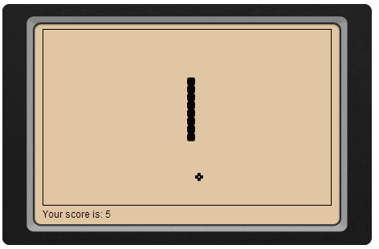
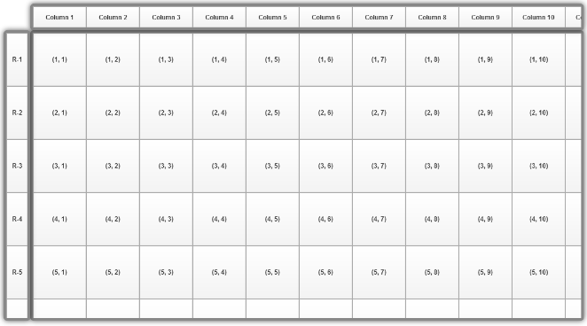

### Author's Notes

Rikulo is a cross-platform framework for creating amazing Web and native mobile applications in Dart and HTML 5. 
You can access your application directly with a modern Web browser without any plug-in. 

You can also build it as a native mobile application accessing the device's resources transparently.

### Demos

[Launch Snake Demo](http://rikulo.org/resource/js/examples/index-snake.html)

[Launch Index Grid Demo](http://rikulo.org/resource/js/examples/index-grid.html)

