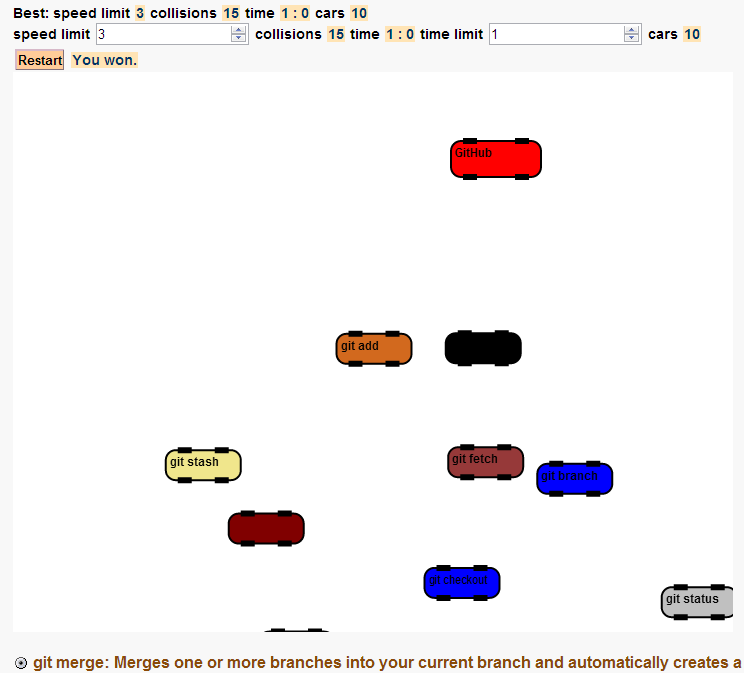

### Author's Notes

Collision Clones is a game with moving cars of different sizes and colors, whose objective is to move the red car within the time limit with few collisions.
You loose if the number of collisions is greater than the time in seconds. After a certain number of collisions, clone cars appear.

### Demos

[Launch Demo](https://www.googledrive.com/host/0B-lFudukJYgfZ2h3ZHcwN1BiU0E/collision_clones/collision_clones.html)

